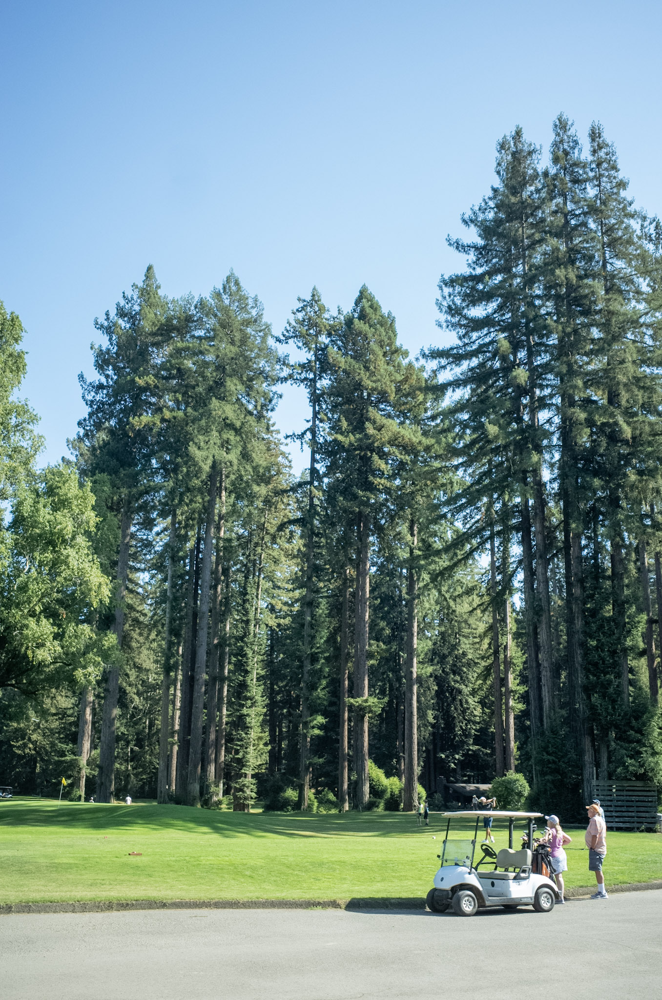
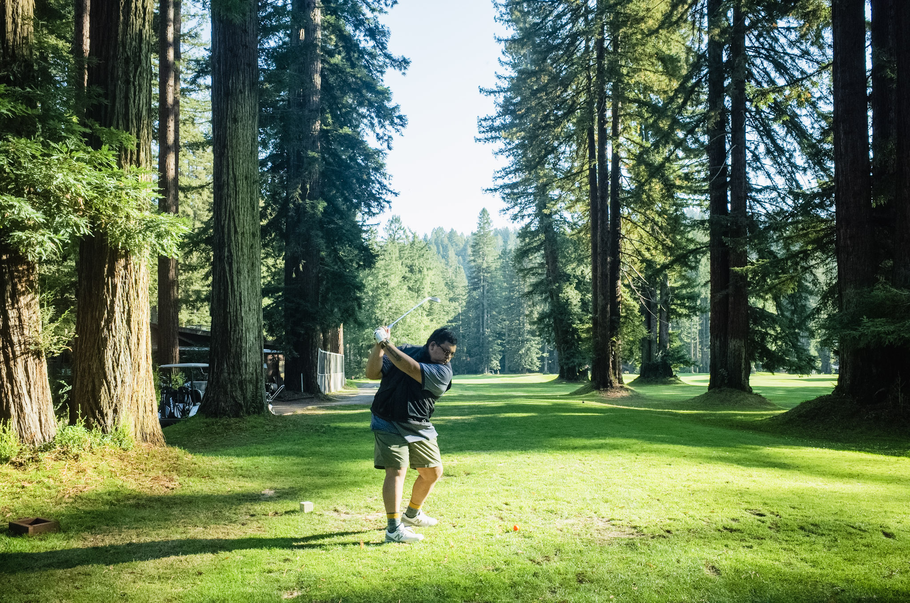
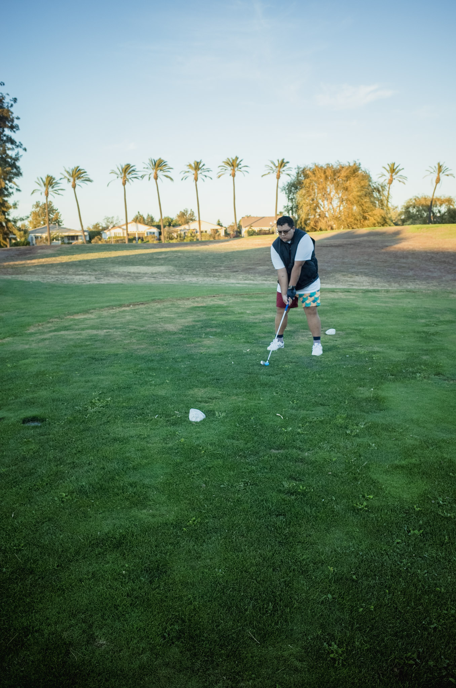
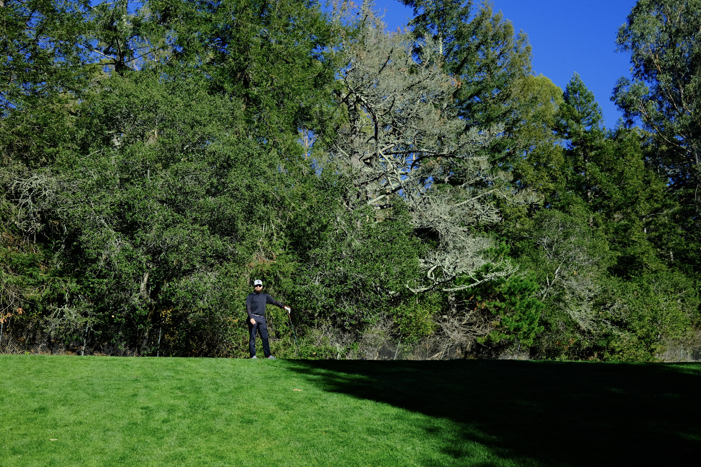
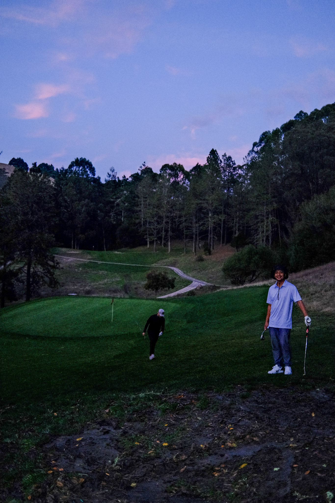

<https://rods-golf-scorecards.netlify.app/>

I want to create an app/site/react component for displaying golf scorecards. I am doing this for a few reasons: 

* I have started to learn how to play golf. I hope to write a bit more about this in a different post but its something I have come to enjoy and hope to continue for the rest of my life.
* I want to continue working on my React/JS skills. Starting my new role as part of a UI team within Adobe has been an amazing experience, something I have wanted for quite some time. I hope to continue working on personal projects (eventually pick back up that card rip twitch bot too) as a way to continue my journey as a developer.

I will continue to write about my experiences in this project as well as anything else I want to write about. Here are some golf pictures:

